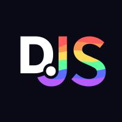

# Discord.js Bot [](https://github.com/stackblaze-templates/discordjs) [](https://stackblaze.com) [](https://github.com/stackblaze-templates/discordjs/actions) [](LICENSE) [](https://stackblaze.com)

<p align="center"></p>

A Discord bot built with discord.js (JavaScript). Features slash commands, event handlers, and a modular command structure.

> **Credits**: Built on [Discord.js Bot](https://discord.js.org) by [discord.js](https://github.com/discordjs). All trademarks belong to their respective owners.

## Deploy on StackBlaze

This template includes a `stackblaze.yaml` for one-click deployment on [StackBlaze](https://stackblaze.com).

## Configuration & Security

The following environment variables **must** be set before running the bot. Never commit real values to source control — use the provided `.env.example` as a reference.

| Variable | Description | Required |
|---|---|---|
| `DISCORD_TOKEN` | Your bot's secret token from the [Discord Developer Portal](https://discord.com/developers/applications). Treat this like a password — rotating it immediately if it is ever exposed. | ✅ Yes |
| `CLIENT_ID` | The application (client) ID of your bot, used to register slash commands. | ✅ Yes |

> ⚠️ **Security warning**: If `DISCORD_TOKEN` is leaked, anyone can log in as your bot. Revoke and regenerate the token immediately via the Discord Developer Portal.

## Local Development

```bash
cp .env.example .env
# Edit .env and fill in DISCORD_TOKEN and CLIENT_ID
npm install
npm start
```

See the project files for configuration details.

---

### Maintained by [StackBlaze](https://stackblaze.com)

This template is actively maintained by StackBlaze. We perform **weekly automated checks** to ensure:

- **Up-to-date dependencies** — frameworks, libraries, and base images are kept current
- **Security scanning** — continuous monitoring for known vulnerabilities and CVEs
- **Best practices** — configurations follow current recommendations from upstream projects

Found an issue? [Open a ticket](https://github.com/stackblaze-templates/discordjs/issues).
